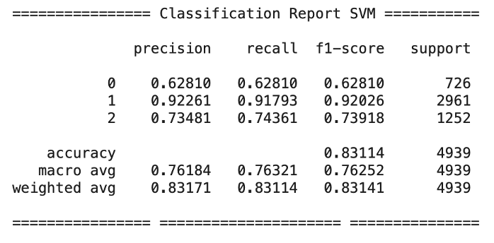
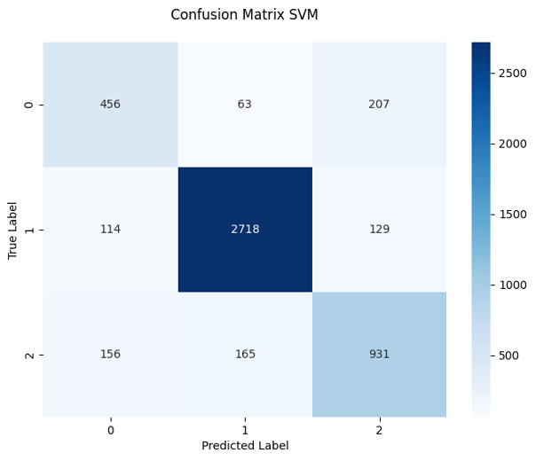
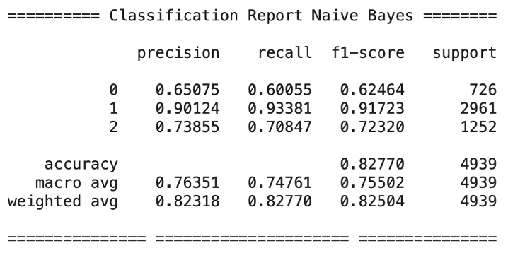
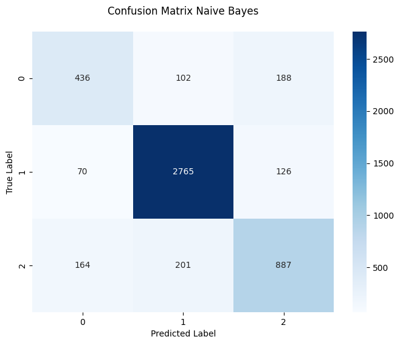

# 🚀 Introducing Meowsenti 🚀

Meowsenti is a simple application designed to analyze sentiment in Indonesian mobile banking applications.

## 🤖 Model Overview

This system is built using two popular Natural Language Processing algorithms: Multinomial Naive Bayes and Support Vector Machine. It has been trained on a dataset of 13,527 reviews from the BRImo mobile banking application.

The dataset is split into 60% for training the model and 40% for testing it.

## MFSvc Model

The MFSvc model is optimized through parameter search using GridSearchCV. Below is an example of the parameter grid used in this model:

| Parameters       | Value          |
| ---------------- | -------------- |
| **C**            | 0.1, 1, 10     |
| **kernel**       | linear, rbf    |
| **gamma**        | scale, auto    |
| **class_weight** | balanced, None |

After the parameter search, the training accuracy was verified using 10-fold cross-validation. The best parameter configuration for training the model is:

```shell
Best parameters found: {'C': 10, 'class_weight': 'balanced', 'gamma': 'scale', 'kernel': 'rbf'}
Best cross-validation accuracy: 95.67%
```

The test classification report is shown below:



The confusion matrix from the test process is also displayed in a heatmap visualization:



## MFNb Model

The MFNb model is optimized through parameter search using GridSearchCV. Below is an example of the parameter grid used for this model:

| Parameters    | Value            |
| ------------- | ---------------- |
| **alpha**     | 0.01, 0.1, 1, 10 |
| **fit_prior** | True, False      |

After the parameter search, the training accuracy was verified using 10-fold cross-validation. The best parameter configuration for training the model is:

```shell
Best parameters found: {'alpha': 0.01, 'fit_prior': True}
Best cross-validation accuracy: 95.23%
```

The test classification report is shown below:



The confusion matrix from the test process is also displayed in a heatmap visualization:



## 📊 Summary of Evaluation Metrics

To further evaluate the performance, metrics such as Accuracy, Precision, Recall, and F1-Score were used as additional indicators to understand how both models handle each sentiment class (Negative, Positive, and Neutral).

### 📈 Support Vector Machine (SVM)

The evaluation metrics for the SVM model are summarized below:

| Class            | Precision | Recall | F1-score |
| ---------------- | --------- | ------ | -------- |
| **1 (Positive)** | 0.9226    | 0.9179 | 0.9202   |
| **0 (Negative)** | 0.6281    | 0.6281 | 0.6281   |
| **2 (Neutral)**  | 0.7348    | 0.7436 | 0.7392   |

- **Train Accuracy:** 95.67%
- **Test Accuracy:** 83.11%

### 📉 Naïve Bayes (NB)

The evaluation metrics for the Naïve Bayes model are summarized below:

| Class            | Precision | Recall | F1-score |
| ---------------- | --------- | ------ | -------- |
| **1 (Positive)** | 0.9012    | 0.9338 | 0.9172   |
| **0 (Negative)** | 0.6507    | 0.6006 | 0.6246   |
| **2 (Neutral)**  | 0.7386    | 0.7085 | 0.7232   |

- **Train Accuracy:** 95.23%
- **Test Accuracy:** 82.77%

---

# How to run meowsenti locally?

## 🐳 Using Docker Container

First, u need to pull this image and run:

```shell
# Puling the image
docker pull mframadann/meowsenti # using default tag "latest"
docker run -d --name sentiment-app -p 5001:7860 mframadann/meowsenti
```

### How to try the app?

Open your api testing tools like postman, insomnia etc.
Here the example of request:

```shell
#There are two types of models. You can select the model type, such as MFNb for Naive Bayes and MFSvc for Support Vector Machine in model field.
curl -X POST \
  http://localhost:5001/api/v1/analyze-sentiment \
  -H "Content-Type: application/json" \
  -d '{
        "reviews": [
           {"review": "Bagus banget aplikasinya"},
           {"review": "Aplikasi apa ini, jelek banget idih"},
           {"review": "Cukup membantu saya bertransaksi"},
           {"review": "Mantap banget euy applikasinya"}
        ],
        "model": "MFNb"
    }'
```

And the app will be give response like:

```json
{
  "data": {
    "sentiment": [
      {
        "alg_type": "Naive Bayes",
        "kind_of_sentiment": "Positive",
        "review": "Bagus banget aplikasinya"
      },
      {
        "alg_type": "Naive Bayes",
        "kind_of_sentiment": "Negative",
        "review": "Aplikasi apa ini, jelek banget idih"
      },
      {
        "alg_type": "Naive Bayes",
        "kind_of_sentiment": "Neutral",
        "review": "Cukup membantu saya bertransaksi"
      },
      {
        "alg_type": "Naive Bayes",
        "kind_of_sentiment": "Positive",
        "review": "Mantap banget euy applikasinya"
      }
    ]
  },
  "status": "success"
}
```

## 💻 Clone Repository

First u need to clone this repository by running

```sh
git clone https://github.com/mframadann/meowsenti.git && cd meowsenti
```

Then, u need to create virtual environtment:

```sh
python3 -m venv .venv
source .venv/bin/activate
```

You also need install the requirements depedencies:

```sh
pip install --no-cache-dir -r requirements.txt
```

Finally, u can start the meowsenti by running:

```sh
python app.py
```

### How to try the app?

Open your api testing tools like postman, insomnia etc.
Here the example of request:

```shell
#There are two types of models. You can select the model type, such as MFNb for Naive Bayes and MFSvc for Support Vector Machine in model field.
curl -X POST \
  http://localhost:7860/api/v1/analyze-sentiment \
  -H "Content-Type: application/json" \
  -d '{
        "reviews": [
           {"review": "Bagus banget aplikasinya"},
           {"review": "Aplikasi apa ini, jelek banget idih"},
           {"review": "Cukup membantu saya bertransaksi"},
           {"review": "Mantap banget euy applikasinya"}
        ],
        "model": "MFNb"
    }'
```

And the app will be give response like:

```json
{
  "data": {
    "sentiment": [
      {
        "alg_type": "Naive Bayes",
        "kind_of_sentiment": "Positive",
        "review": "Bagus banget aplikasinya"
      },
      {
        "alg_type": "Naive Bayes",
        "kind_of_sentiment": "Negative",
        "review": "Aplikasi apa ini, jelek banget idih"
      },
      {
        "alg_type": "Naive Bayes",
        "kind_of_sentiment": "Neutral",
        "review": "Cukup membantu saya bertransaksi"
      },
      {
        "alg_type": "Naive Bayes",
        "kind_of_sentiment": "Positive",
        "review": "Mantap banget euy applikasinya"
      }
    ]
  },
  "status": "success"
}
```

# Api Documentation

For more comperhensf api docs you can visit my labs: [Mframadan Labs](https://labs.mframadan.dev)

# More Resources

The app also production ready if u just want to try the app directly.
Visit the my huggingface space: [My space](https://huggingface.co/spaces/mframadann/meowsenti).

# Noted: This model is work on indonesian language only.

Thankyou for visit, lets connected with me: [LinkedIn](https://linkedin.com/in/muhamad-firly-ramadan)
